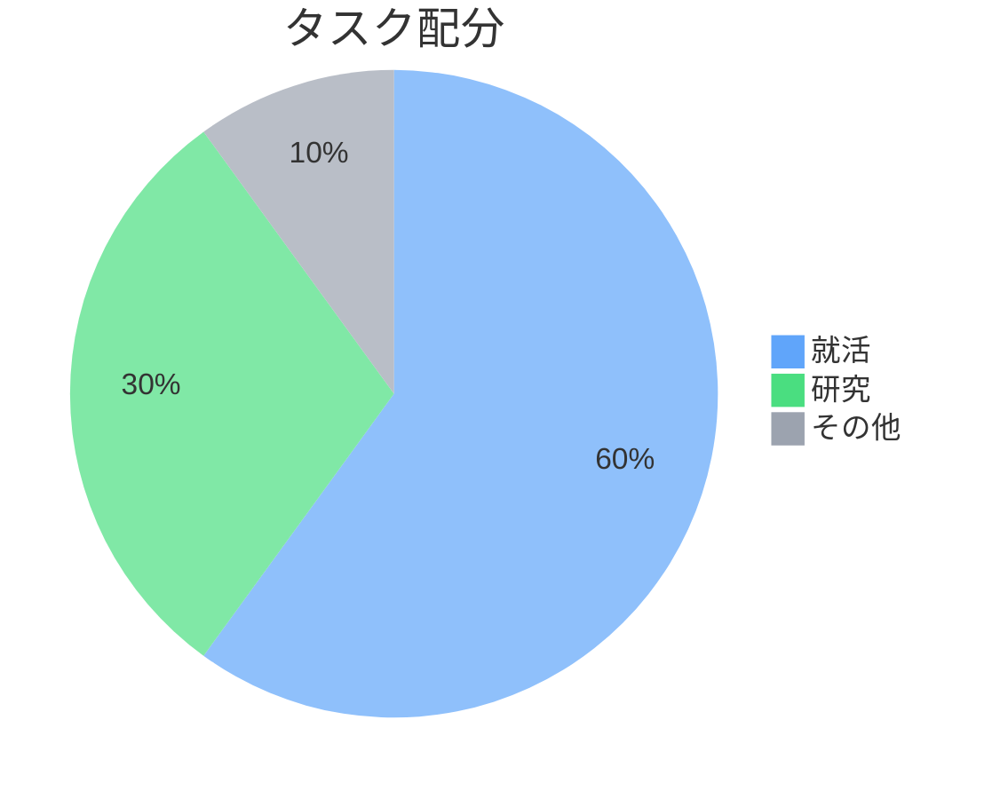
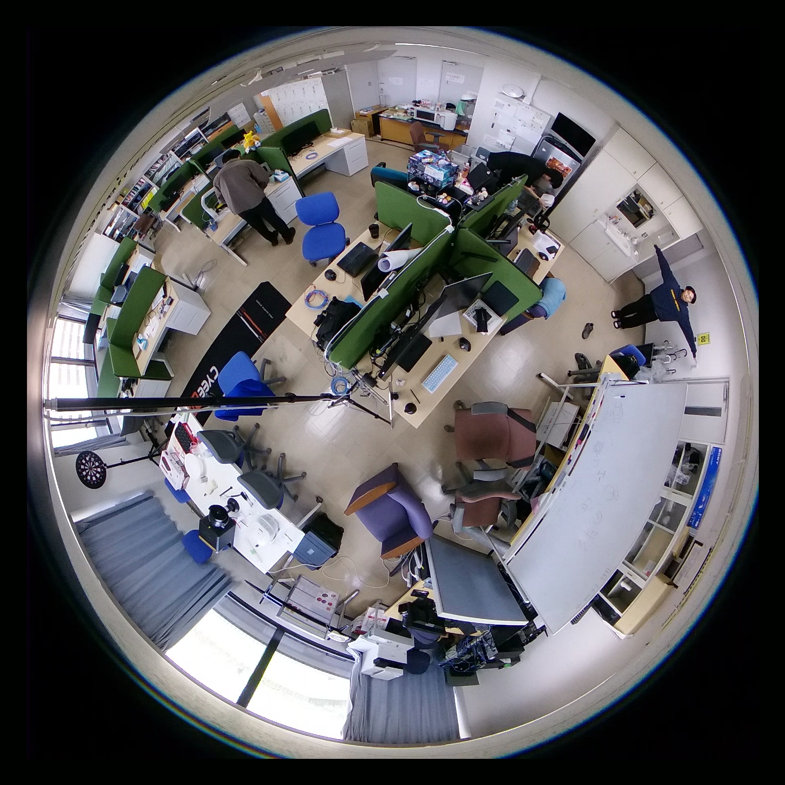
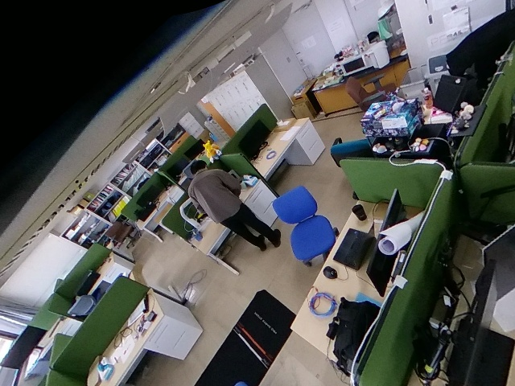

::title::
進捗報告

::date::
2026年05月15日

::default::
マルチメディアデータモデリング (佐々木) 研究室

山中春輝

---
layout: toc
---

::title::
目次

---
layout: section
---

# 活動の内訳

---
layout: two-cols
---

::title::
活動の内訳

::left::
現在のタスクについての配分

就活：６割

研究：３割

その他：１割

::right::

::conc::
就活にウェイトを置いている

---
layout: section
---

# 研究進捗

---

::title::
論文調査

::default::
1. 3D human pose estimation and action recognition using fisheye cameras: A
survey and benchmark
    - 去年の姿勢推定およびジェスチャ認識手法のサーベイ論文
2. Human Pose Estimation in Monocular Omnidirectional Top-View Images
    - 魚眼かつ俯瞰視点用のデータセットを作成し、従来の骨格認識モデルでその有効性を示した
    - 局所的な平坦化をせずにそのまま骨格認識をしている
3. FlyPose: Towards Robust Human Pose Estimation From Aerial Views
    - 骨格の制約に基づく合成データセットを作成する手法を提案(魚眼ではない通常画角の話)
    - データセットの種類が少ない真上から/真下からの視点でのデータセットの生成

次に読む論文: Multi-person 3D pose estimation from a single image captured by a fisheye camera

---

::title::
現段階でわかったこと

::default::
魚眼画像で骨格認識をしている論文はほぼ無い(サーベイ論文内でも1件しか報告されていない)

魚眼画像をそのまま処理する明確な理由が無い(局所的な平坦化を試していない)

---

::title::
やるべきことをわける

::default::
システムを構築する要素として以下が考えられる

- 魚眼画像からの骨格認識
    - これが簡単なのか難しいのかわからない
- 動的ハンドジェスチャー認識
- 魚眼画像内の腕ベクトルの方向推定

これが進んだら

- 誤検知防止

---
layout: two-cols
---

::title::
魚眼画像の補正を試す

::left::

::right::

::conc::
検出した人物を中心に据えて補正

---
layout: section
---

# 就活進捗

---

::title::
インターンシップ

::default::
応募予定企業

- チームラボ
- LINEヤフー
- セコムIS
- not a hotel

コーディングテストがぼろぼろなので対策を強化する

LINEヤフーのWEBテストが05/25からなのでそこまでにある程度の知識を積む

---
layout: section
---

# 今後の予定

---

::title::
今後の予定

::default::

- AtCoder系の問題を沢山解く(05/25までに)
    - 「プログラミングコンテスト攻略のためのアルゴリズムとデータ構造」を1〜2周
    - 毎日のコンテストに参加
- 研究は魚眼画像の平坦化から取り組む
