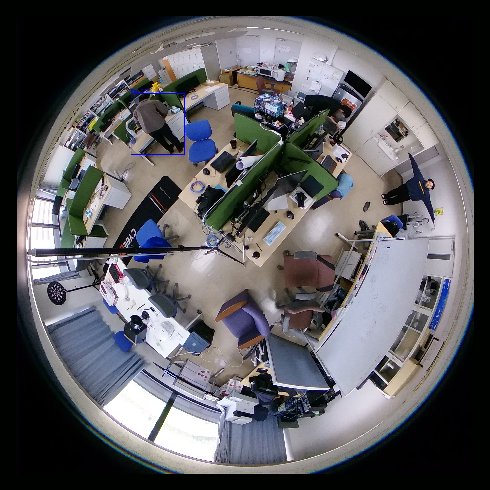
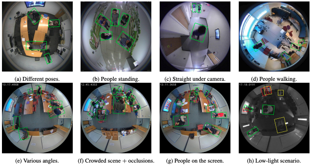

::title::
進捗報告

::date::
2026年05月29日

::default::
マルチメディアデータモデリング (佐々木) 研究室

山中春輝

---
layout: toc
---

::title::
目次

---
layout: section
---

# 研究進捗

---

::title::
魚眼カメラの必然性

::default::
1. 研究目的

    リアルタイムかつ家庭内に常設可能な空間インターフェースの実現といえる
    
2. システム要件

    低計算量かつ保守負担の少ない構成であること
    
    室内全体を単一座標系として一貫して把握できること
    
3. 要件から導かれる構成

    単一視点かつ超広角な俯瞰撮影

---
layout: two-cols
---

::title::
複数カメラ vs 魚眼カメラ

::left::
**Multi-View**

複数視点による高精度な姿勢推定が可能

各カメラの情報を単一座標系へ統合する必要がある

結果的に計算量及び運用負荷が増大する

特にカメラ位置のズレや模様替えによる再キャリブレーションが発生する可能性も

::right::
**Fisheye-View**

俯瞰視点を用いることで室内全体を単一座標系で観測できる

また、キャリブレーション負荷を低減できる

---

::title::
参考文献として

::default::
1. Efficient Pedestrian Detection in Top-View Fisheye Images Using Compositions of Perspective View Patches

2. DeePoint: Visual Pointing Recognition and Direction Estimation

---
layout: two-cols
---

::title::
魚眼画像の補正を試す

::left::

::right::

---

::title::
検出精度の問題

::default::

---
layout: two-cols
---

::title::
魚眼画像内での人物検出

::left::

**RAPiD: Rotation-Aware People Detection in Overhead Fisheye Images**

<figure>
  
  <figcaption>図2: RAPiD論文における魚眼画像内人物検出の例</figcaption>
</figure>

::right::
魚眼画像内の人物を検出し、バウンディングボックスを人物にフィットさせる

ボトムアップアプローチだから速い

実装をこれからする

---
layout: section
---

# 就活進捗

---

::title::
インターン申込み企業

::default::
- チームラボ
- LINE Yahoo
- Mercari
- セコムIS
- CTC
- DeNA

---
layout: section
---

# 今後の予定

---

::title::
今後の予定

::default::

- 人物検出の高精度化

- 就活多めで
