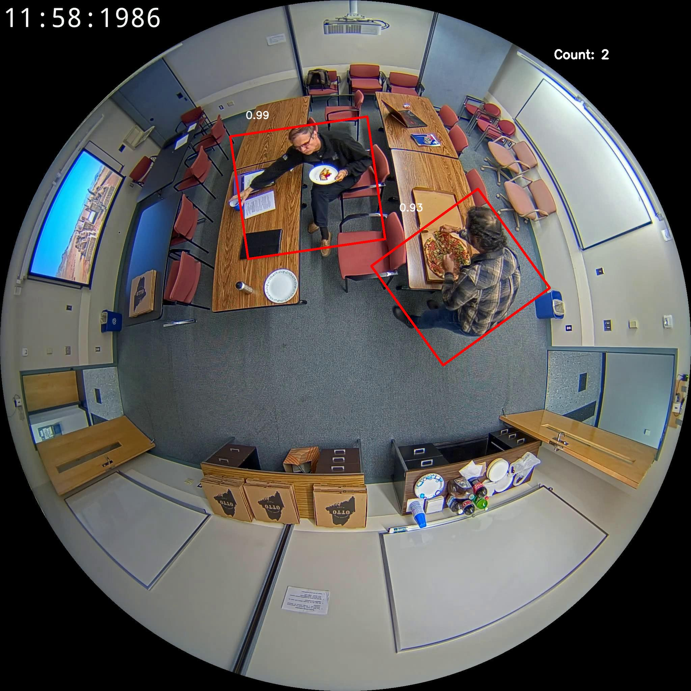
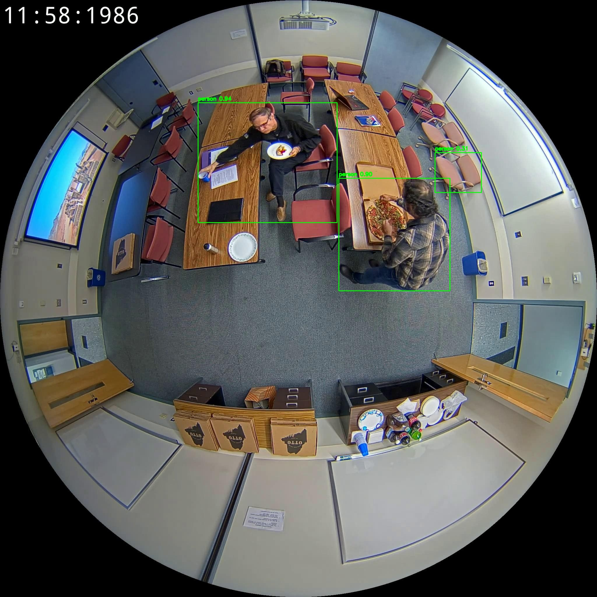
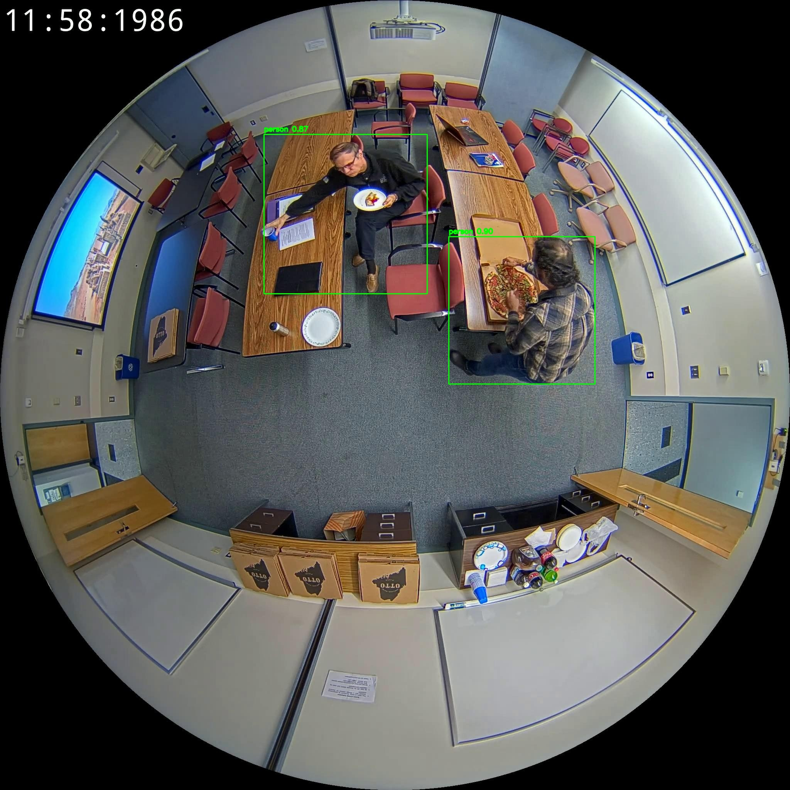
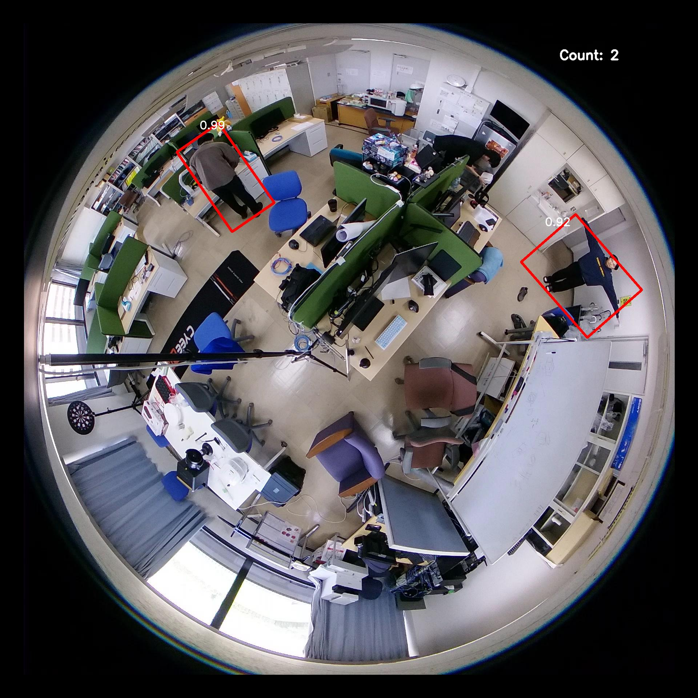
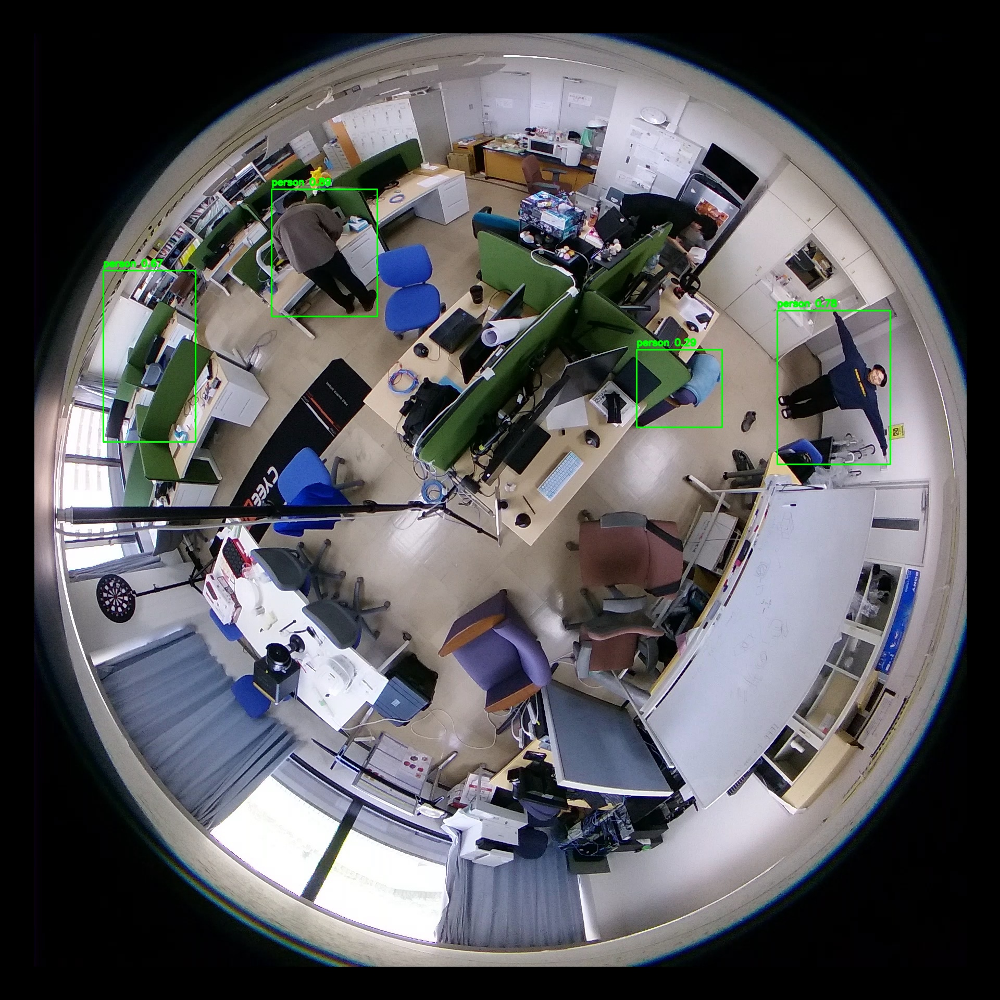
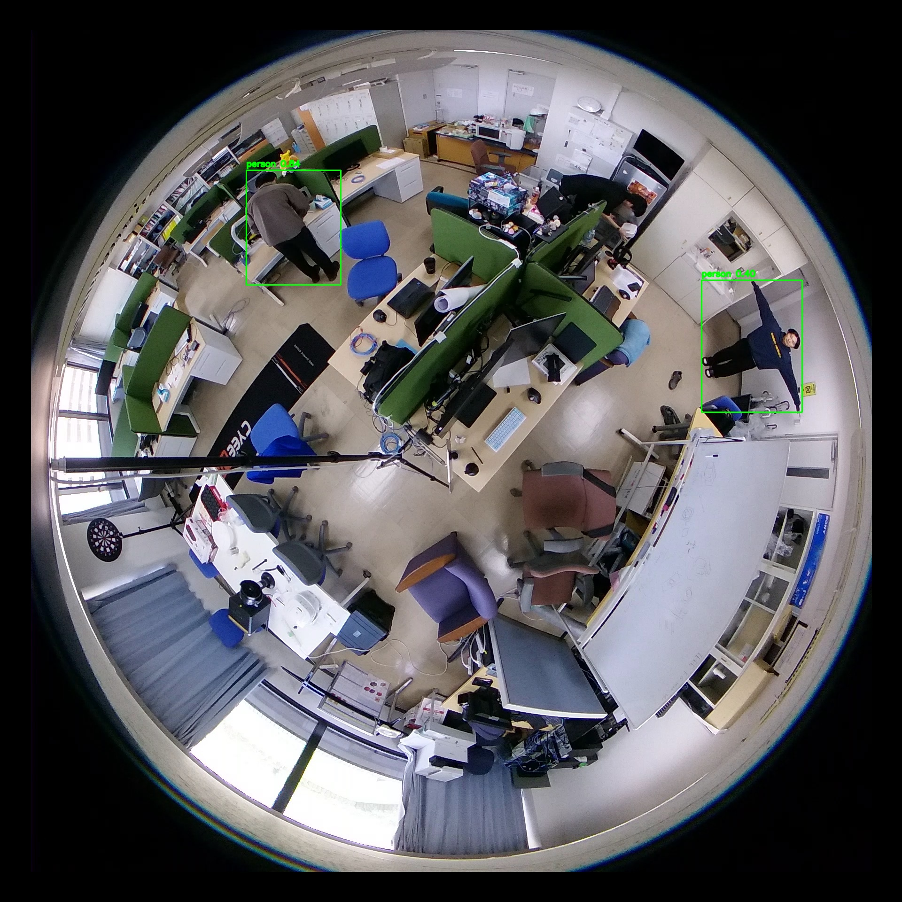
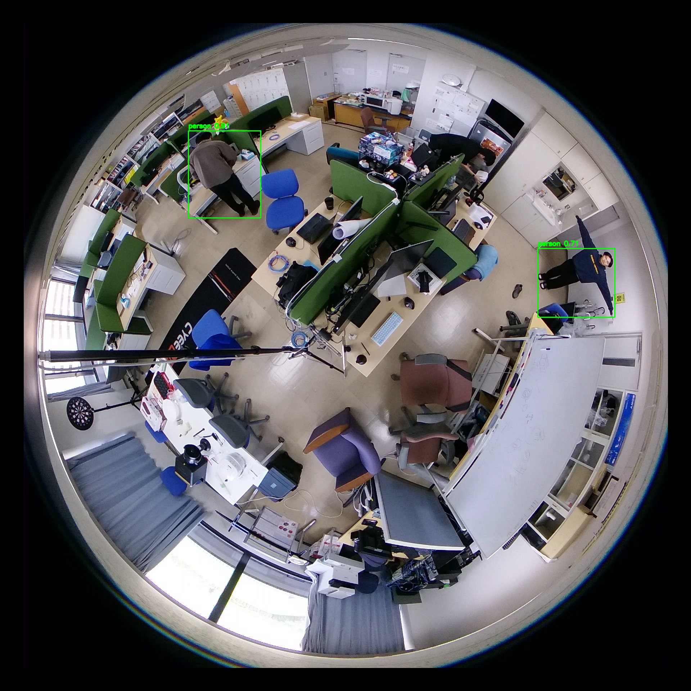

::title::
進捗報告

::date::
2026年06月12日

::default::
マルチメディアデータモデリング (佐々木) 研究室

山中春輝

---
layout: toc
---

::title::
目次

---
layout: section
---

# 研究進捗

---

::title::
検出モデルの探求

::default::
- 目的
  
  魚眼画像で人物を安定して検出できるモデルを比較検証する

- 評価データ
  
  CEPDOFデータセットの一部・実環境データ

- 評価指標

  検出精度・推論速度・モデルサイズ

- 比較対象モデル
  
  YOLOv8・YOLO11・YOLO26・RAPiD(魚眼特化モデル)

---
layout: default
---

::title::
検出結果の比較

::default::

  

  
RAPiD

  
YOLOv8

  
YOLO11

  
YOLO26

  
CEPDOF

  
  
  
  

  
実環境

  
  
  
  

---

::title::
RAPiDの結果

::default::

  

    
    
CEPDOF: 2件 / 49.0ms / conf 0.990, 0.932

  

  

    
    
実環境: 2件 / 45.4ms / conf 0.991, 0.919

  

---

::title::
YOLOv8mの結果

::default::

  

    
    
CEPDOF: 3件 / 5.2ms / conf 0.939, 0.901, 0.310

  

  

    
    
実環境: 4件 / 5.2ms / conf 0.890, 0.776, 0.666, 0.293

  

---

::title::
YOLO11mの結果

::default::

  

    
    
CEPDOF: 2件 / 6.1ms / conf 0.904, 0.866

  

  

    
    
実環境: 2件 / 6.2ms / conf 0.836, 0.398

  

---

::title::
YOLO26mの結果

::default::

  

    
    
CEPDOF: 2件 / 6.4ms / conf 0.950, 0.941

  

  

    
    
実環境: 2件 / 6.3ms / conf 0.912, 0.706

  

---

::title::
結論

::default::
- 精度はRAPiDが最も高精度

- ただし推論速度がネックになるかもしれない

- 次のステップでもYOLOとRAPiDを比較してみることにした

---
layout: section
---

# 就活進捗

---

::title::
インターンシップ

::default::
待ちの企業

- チームラボ
- LINEヤフー
- CTC
  
これから受験
- DeNA
- セコムIS
- DMM
- Mercari

---
layout: section
---

# 今後の予定

---

::title::
今後の予定

::default::

- 局所補正あり・なしで骨格検出を試す

- インターンシップはどこかしら行きたいので応募増やす(単位が出るところへ)